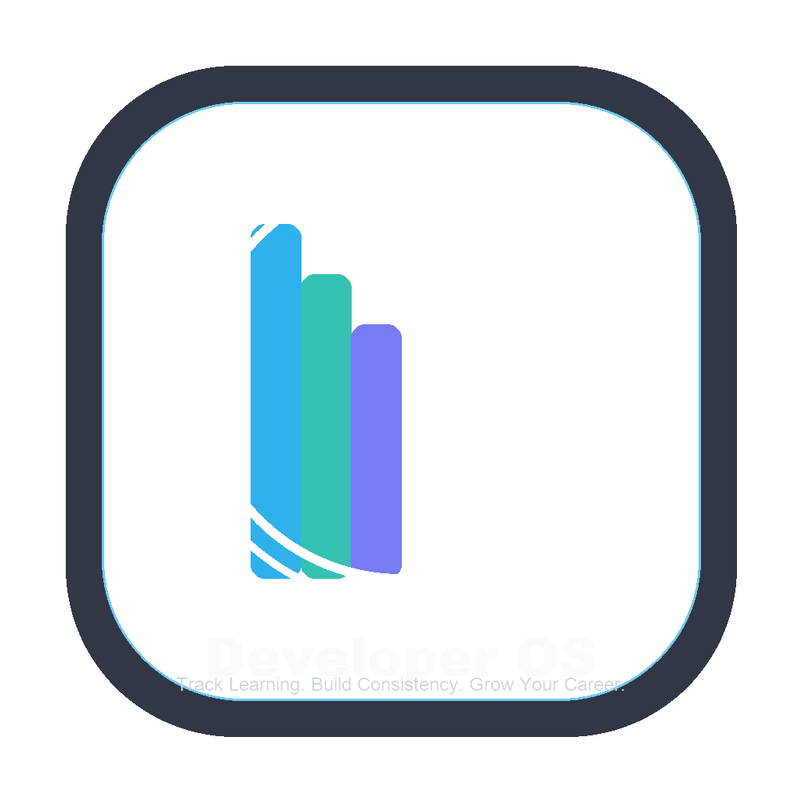
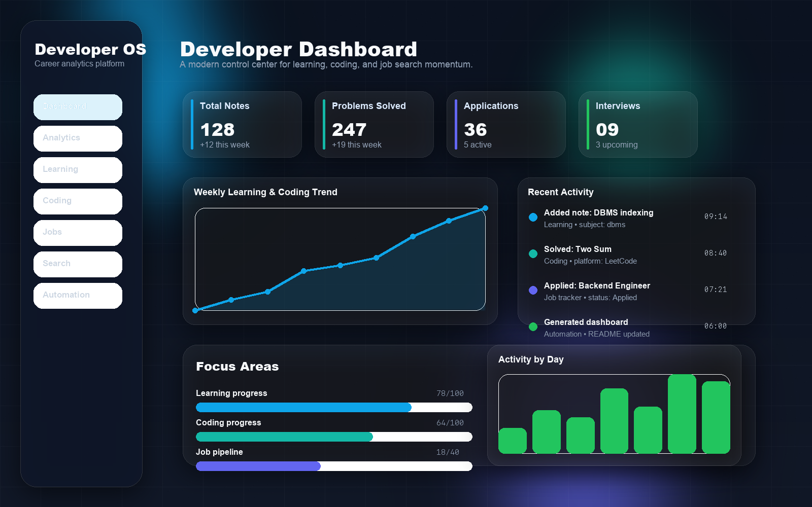
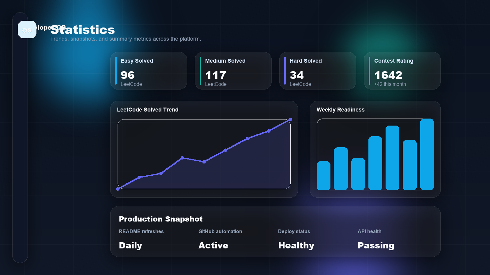
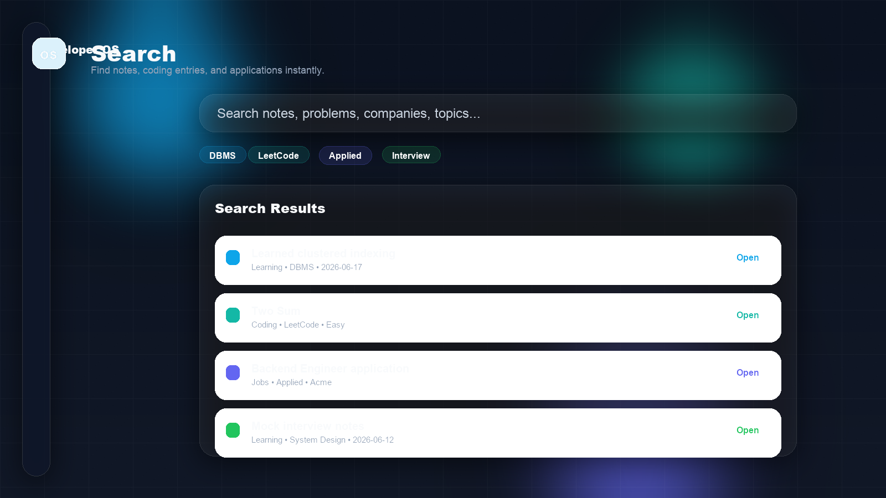
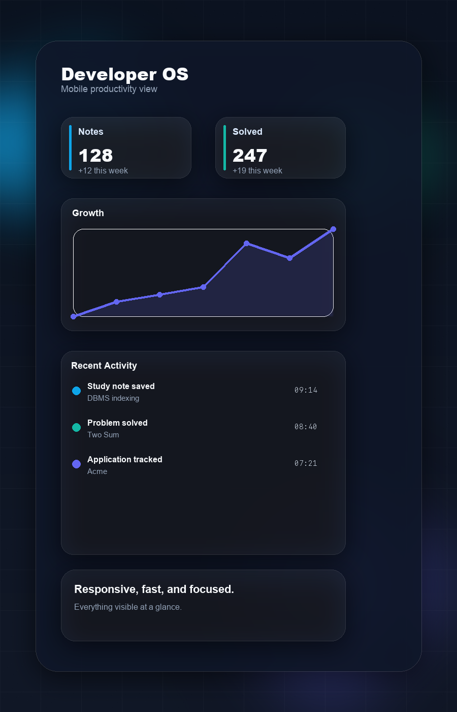
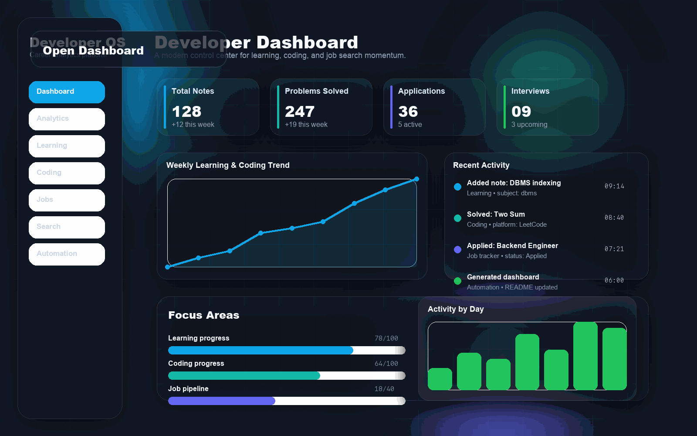
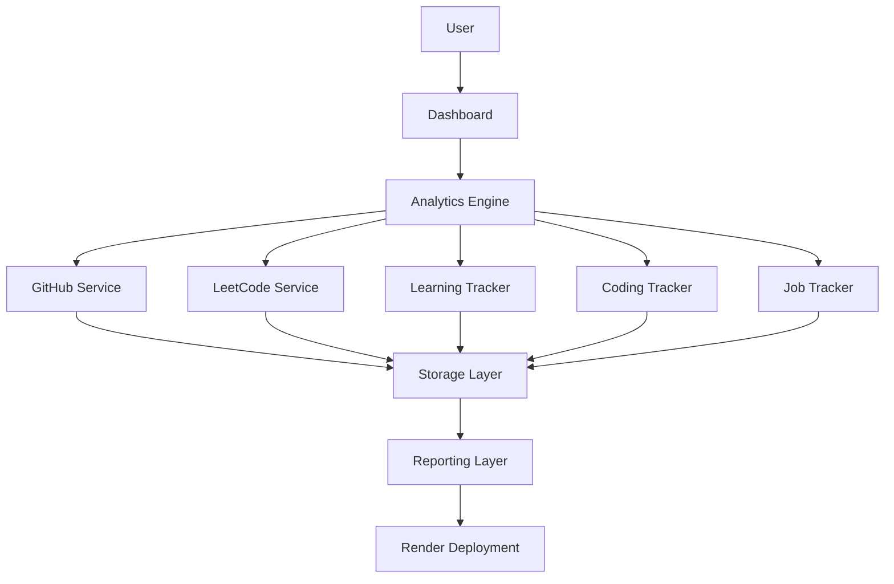
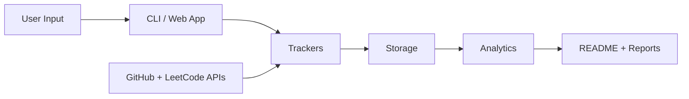
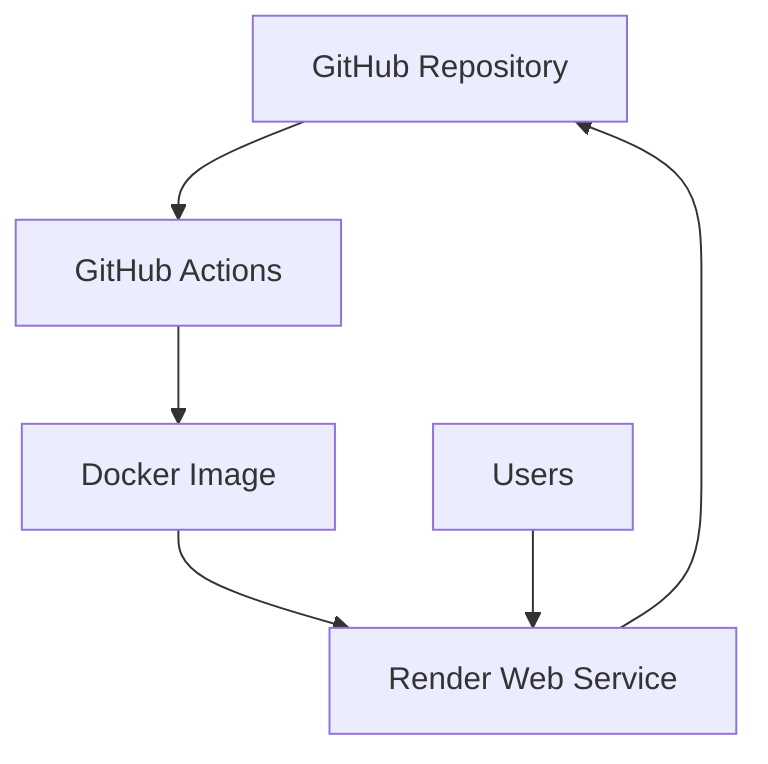

# Developer OS

<p align="center">
  
</p>

<p align="center">
  <strong>Track Learning. Build Consistency. Grow Your Career.</strong>
</p>

<p align="center">
  A personal operating system that turns learning, coding, and career activity into a polished developer dashboard.
</p>

<p align="center">
  <a href="https://developer-os.onrender.com"></a>
  <a href="https://github.com/susatwik/developer-os"></a>
</p>

<p align="center">
  
  
  
  
  
  
</p>

<p align="center">
  
</p>

---

## Metrics

<table>
  <tr>
    <td><strong>Version</strong><br />1.0.0</td>
    <td><strong>Tests</strong><br />25 passing</td>
    <td><strong>Coverage</strong><br />88.17%</td>
    <td><strong>Deployment</strong><br />Render live</td>
  </tr>
  <tr>
    <td><strong>Workflows</strong><br />5 scheduled</td>
    <td><strong>API Routes</strong><br />9 public endpoints</td>
    <td><strong>Platform Availability</strong><br />Web + CLI</td>
    <td><strong>Automation</strong><br />Daily / weekly / monthly</td>
  </tr>
</table>

## Why It Matters

Developer OS exists to make progress visible.

- **Learning consistency** becomes measurable instead of scattered across notes.
- **Career growth** becomes trackable instead of hard to explain in interviews.
- **Technical discipline** becomes a repeatable system, not a one-off sprint.
- **Developer productivity** becomes something you can review, refine, and improve.

## What Makes Developer OS Different

| Traditional tool | Limitation | Developer OS advantage |
| --- | --- | --- |
| Spreadsheets | Manual updates, no live context | Automated analytics with historical snapshots |
| Notion pages | Great for notes, weak for metrics | Structured tracking with dashboards and trends |
| Random notes | Hard to search and review | Organized by subject, platform, company, and status |
| Habit trackers | Measure streaks, not outcomes | Measures learning, coding, and career progress together |

## Features

<table>
  <tr>
    <td width="33%"><strong>Learning Tracker</strong><br />Turns daily notes into a searchable growth log.</td>
    <td width="33%"><strong>Coding Tracker</strong><br />Converts practice into measurable problem-solving momentum.</td>
    <td width="33%"><strong>GitHub Analytics</strong><br />Surfaces profile activity, repositories, stars, and followers.</td>
  </tr>
  <tr>
    <td width="33%"><strong>LeetCode Analytics</strong><br />Stores solved counts and trends as historical snapshots.</td>
    <td width="33%"><strong>Job Tracker</strong><br />Keeps applications, OA rounds, interviews, and offers organized.</td>
    <td width="33%"><strong>Dashboard</strong><br />Turns raw records into a recruiter-friendly command center.</td>
  </tr>
  <tr>
    <td width="33%"><strong>Search</strong><br />Find notes, problems, and applications in seconds.</td>
    <td width="33%"><strong>Automation</strong><br />Refreshes reports and README content on schedule.</td>
    <td width="33%"><strong>Cloud Deployment</strong><br />Runs on Render with health checks and version endpoints.</td>
  </tr>
</table>

## Screenshots

<table>
  <tr>
    <td width="50%"></td>
    <td width="50%"></td>
  </tr>
  <tr>
    <td width="50%"></td>
    <td width="50%"></td>
  </tr>
</table>

<p align="center">
  
</p>

> The visuals are designed to feel like a modern SaaS product, not a classroom project.

## Architecture

### System Architecture



### Data Flow Diagram



### Deployment Architecture



## Technology Stack

<p align="center">
  
  
  
  
  
  
  
  
</p>

| Layer | Tools |
| --- | --- |
| Application | Python, FastAPI, Jinja2 |
| Data | JSON storage, CSV import/export, historical snapshots |
| Automation | GitHub Actions, scheduled workflows, report refreshes |
| Quality | Ruff, Pytest, coverage reporting |
| Deployment | Docker, Gunicorn, Uvicorn, Render |

## Production Readiness

- **Testing:** 25 passing tests.
- **Coverage:** 88.17%.
- **Deployment:** Render live with Docker support.
- **Monitoring:** `/health` and `/version` endpoints.
- **Automation:** daily, weekly, monthly, and heartbeat workflows.
- **CI/CD:** GitHub Actions for lint, test, and scheduled refreshes.
- **Documentation:** installation, deployment, contributing, security, and release notes are included.

## Roadmap

### Short Term

- AI Career Coach
- Resume Analyzer
- Interview Assistant

### Long Term

- AI Agent Ecosystem
- Multi-user Platform
- Team Analytics

## Installation

### Local Setup

```bash
git clone https://github.com/susatwik/developer-os.git
cd developer-os
python3 -m pip install -e '.[web]'
developer-os-web
```

### Virtual Environment

```bash
python3 -m venv .venv
source .venv/bin/activate
python3 -m pip install --upgrade pip
python3 -m pip install -e '.[dev,web]'
```

### Docker Setup

```bash
docker compose up --build
```

### Render Deployment

1. Push the repository to GitHub.
2. Connect the repository in Render.
3. Set the required `DEVOS_*` environment variables.
4. Follow [docs/deployment.md](docs/deployment.md).

## API Reference

| Method | Endpoint | Purpose |
| --- | --- | --- |
| `GET` | `/dashboard` | Main dashboard view |
| `GET` | `/stats` | Statistics page |
| `GET` | `/search` | Search entries |
| `GET` | `/health` | Health check |
| `GET` | `/version` | App version |
| `POST` | `/refresh` | Refresh dashboard data |
| `POST` | `/notes` | Add a learning note |
| `POST` | `/coding` | Add a coding entry |
| `POST` | `/applications` | Add a job application |

## Contributing

- Read [CONTRIBUTING.md](CONTRIBUTING.md) before opening a pull request.
- Use focused issues and small pull requests.
- Include tests and documentation when behavior changes.

## License

Released under the MIT License. See [LICENSE](LICENSE).
