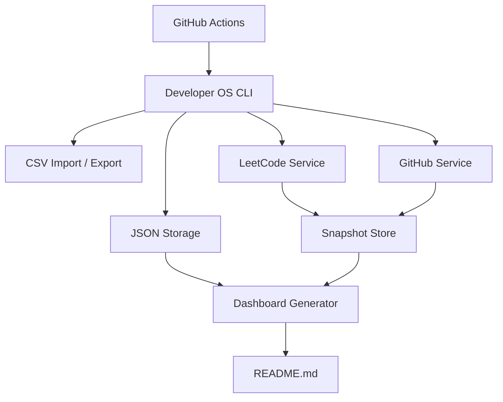
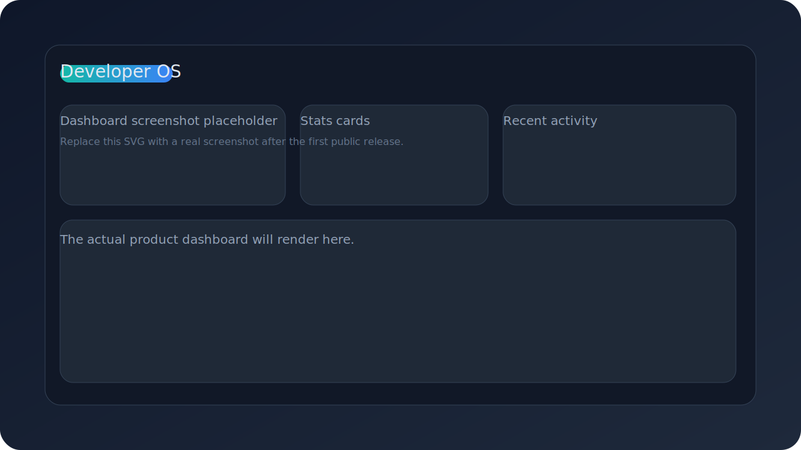

# Developer OS Weekly Summary

# Developer OS

Developer OS is a production-style developer analytics platform for tracking learning, coding, job search progress, and live profile stats in one place.

## Project Overview

Developer OS combines a lightweight Python CLI, JSON-backed manual tracking, CSV import/export, live integrations for LeetCode and GitHub, and GitHub Actions automation to create a maintainable personal analytics hub.

## Features

- Learning tracker for daily notes organized by subject and topic.
- Coding tracker for LeetCode and GeeksforGeeks progress.
- Job application tracker for applications, OA rounds, interviews, and offers.
- CSV import and export with sample templates and validation.
- Live LeetCode integration with historical snapshots.
- Live GitHub integration for profile and repository analytics.
- Automated README dashboard generation from the latest data.
- Scheduled GitHub Actions workflows for daily, weekly, and monthly refreshes.

## Architecture Diagram



## Installation

```bash
python3 -m pip install -e .
developer-os --help
```

## Usage Examples

```bash
developer-os add-note --subject dbms --topic indexing --summary "Learned clustered and non-clustered indexing"
developer-os add-problem --platform leetcode --name "Two Sum" --difficulty easy --topic arrays
developer-os add-application --company "Acme" --role "Backend Engineer" --status Applied
developer-os import-notes --file templates/learning_notes_template.csv
developer-os import-coding --file templates/coding_progress_template.csv
developer-os import-jobs --file templates/job_applications_template.csv
developer-os generate-csv-templates
developer-os generate-dashboard
```

## Dashboard Screenshot Placeholder



> Replace the placeholder above with a real screenshot of your generated dashboard when you have one.

## Roadmap

- Add charts for weekly and monthly trends.
- Add filtering by subject, company, platform, and status.
- Add optional SQLite storage for larger histories.
- Add richer dashboard rendering for trend summaries.
- Add auth-aware GitHub integrations for private profile data.

## Technologies Used

- Python 3.10+
- Standard library JSON and CSV tooling
- GitHub API
- LeetCode GraphQL API
- GitHub Actions
- Mermaid for architecture documentation

## Overview

- Total Notes: 0
- Total Problems Solved: 0
- Applications Sent: 0
- Interviews: 0
- Offers: 0

## GitHub Statistics

- Username: Not configured
- Public Repositories: 0
- Stars: 0
- Followers: 0
- Contributions This Year: 0
- Status: unavailable
- Error: Missing GitHub username. Set it in config.yaml or the matching DEVOS_* environment variable.

### Recent Repositories
- No recent repositories yet.

## Coding Statistics

- Username: Not configured
- Total Solved: 0
- Easy Solved: 0
- Medium Solved: 0
- Hard Solved: 0
- Contest Rating: N/A
- Status: unavailable
- Error: Missing LeetCode username. Set it in config.yaml or the matching DEVOS_* environment variable.

## Trend Summaries

### GitHub
- No previous snapshot available yet.

### LeetCode

- No previous snapshot available yet.

## Recent Activity

- No activity yet

## Learning Tracker

### By subject
- None yet

## Job Application Tracker

### Status counts
- None yet

## Configuration

- `config.yaml` stores usernames, tokens, and storage paths.
- Environment variables override config values.
- Supported environment variables: `DEVOS_GITHUB_USERNAME`, `DEVOS_GITHUB_TOKEN`, `DEVOS_LEETCODE_USERNAME`, `DEVOS_LEETCODE_SESSION_COOKIE`, `DEVOS_CONFIG_PATH`, `DEVOS_SNAPSHOTS_DIR`, `DEVOS_DASHBOARD_PATH`.

## Folder Structure

```text
developer-os/
├── developer_os/           # Python package
├── scripts/                # CLI wrapper
├── templates/              # Sample CSV templates
├── data/                   # JSON storage, snapshots, and reports
├── config.yaml             # Local configuration
├── .github/workflows/      # Scheduled automation
├── pyproject.toml          # Project metadata
└── README.md               # Generated dashboard
```

## Automation

- Daily workflow refreshes `README.md` and `data/reports/dashboard.md`.
- Weekly workflow refreshes the dashboard snapshot and the weekly report.
- Monthly workflow refreshes the dashboard snapshot and the monthly report.

## CSV Templates

- `templates/learning_notes_template.csv`
- `templates/coding_progress_template.csv`
- `templates/job_applications_template.csv`

## CSV Export

- `export-notes` writes learning notes to a CSV file.
- `export-coding` writes coding progress to a CSV file.
- `export-jobs` writes job applications to a CSV file.
